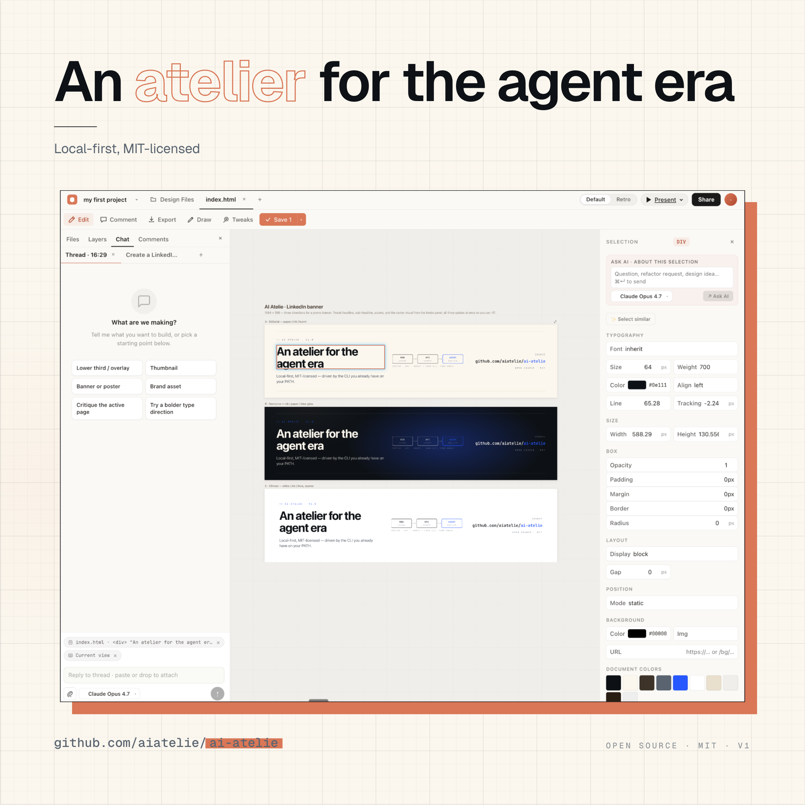

# AI Atelie

> **The open-source alternative to Anthropic's Claude Design.** Local-first, MIT-licensed, driven by the agent CLI you already have on your `PATH`.



## What this is

AI Atelie is a **local-first, open-source design atelier** — an open alternative to Anthropic's Claude Design. Each design lives as a sandboxed folder of HTML, JSX, and CSS that you and an agent CLI shape together — through chat, in-design knobs, or direct inspect-and-edit, like Figma.

The differentiator is **delegation and openness**. Rather than bundling a proprietary agent, AI Atelie wires into the CLI you already have on your `PATH` — Claude Code (subscription OAuth, no API key required), Kimi K2, Codex, or any SDK-compatible model. Skills, templates, and design systems are plain folders you can fork, replace, or extend.

## Why this exists

Anthropic's Claude Design is an incredible tool — but it's closed: rate-limited, gated runtime, no way to bring your own model. I have other agent CLIs running locally that I pay for, all sitting idle while one tool gates my workflow.

AI Atelie is the open-source alternative. Same composable-skills philosophy. Fully local. MIT-licensed. Bring whatever coding agent you already use. Your designs live as plain HTML/JSX/CSS folders you can read, diff, fork, and ship — no proprietary canvas format, no cloud lock-in.

## Quick start

```bash
git clone https://github.com/aiatelie/ai-atelie.git
cd ai-atelie
bun install
bun run dev
```

Open <http://localhost:5173>. The repo ships with a **bundled demo project** (a 3-direction LinkedIn banner) so you can poke at a real artifact before scaffolding your own — click the **demo** card to land in the editor.

To create your own from scratch: hit **+ New project**, walk through the onboarding form, and the agent starts designing.

**Requirements:** Bun 1.x, plus one of:
- [Claude Code](https://claude.com/claude-code) on your `PATH` (recommended), or
- [Kimi CLI](https://github.com/MoonshotAI/Kimi-CLI) configured with a session

## Architecture

```
┌────────────┐      ┌────────────┐      ┌──────────────────────┐
│   web/     │ ←──→ │   api/     │ ←──→ │  agent CLI           │
│   React    │  SSE │   Bun      │      │  (Claude / Kimi)     │
│   + Vite   │      │   + Hono   │      │                      │
└────────────┘      └────────────┘      └──────────────────────┘
                          │
                          ↓
                    ┌────────────┐
                    │   mcp/     │   ask-user, starters, capabilities
                    └────────────┘
                          │
                          ↓
                    ┌────────────┐
                    │  skills/   │   composable playbooks
                    └────────────┘
```

Each project lives at `web/projects/<id>/` — its own HTML/JSX/CSS files, served raw to the iframe canvas. No build step inside a project; pages run with CDN React + Babel-Standalone.

### Three edit paths

| Path | Speed | Use case |
|---|---|---|
| **Tweaks** (in-design knobs) | instant | predefined controls declared via `EDITMODE` markers |
| **Inspector** (CSS overrides) | instant, no AI | ad-hoc CSS changes on any element |
| **Bake to source** (agent edit) | AI roundtrip | when the inspector edit needs to become permanent |

## Skills

Nine composable skills, each a `SKILL.md` Claude Code auto-discovers:

- `frontend-design` — aesthetic direction outside an existing brand system
- `make-tweakable` — add in-design tweak controls
- `interactive-prototype` — working app with real interactions
- `create-design-system` — design system / UI kit
- `animated-video` — timeline-based motion design
- `save-as-standalone-html` — single self-contained offline file
- `send-to-canva` — export as editable Canva design
- `handoff-to-claude-code` — developer handoff package
- `export` — PNG / JPEG / OGraf export for video editors

Drop a new `<skill-name>/SKILL.md` into `skills/` to add your own.

## Starters

`mcp/starters/` ships ready-to-copy components the agent drops into a project via `copy_starter`:

- `DesignCanvas.jsx` — Figma-lite canvas (sections, artboards, pan/zoom). The agent uses this whenever you ask for "2+ variations on a canvas." Includes the `__page_is_canvas` postMessage that switches the host editor into canvas mode.
- `Stage16x9.jsx` / `Stage9x16.jsx` — auto-scaling stages for YouTube-format and Reels/Shorts-format designs.
- `LowerThird.jsx` — broadcast-style title strip with EDITMODE-marked tweakable defaults.

Add your own by dropping a file into `mcp/starters/` and registering it in `mcp/starters-server.mjs`.

## Templates

The "New from template" dialog is empty by default. Add your own by populating `web/src/data/templates.ts` with entries pointing at routes you've scaffolded inside `web/projects/`.

## Demo project

`web/projects/demo/` is a real working project bundled with the repo — three LinkedIn-banner directions (Editorial, Nocturne, Clinical) on a `DesignCanvas`, with tweakable knobs for headline copy, accent color, and the center visual. Open it in the editor to see what the tool produces; fork it to riff. Other per-user projects you create live alongside it under `web/projects/<id>/` and stay untracked.

## Status

Alpha. Solo-built, used in anger by the author. APIs and project formats may change. Issues and PRs welcome.

## Contributing

- [CONTRIBUTING.md](./CONTRIBUTING.md) — repo conventions, security model, what's accepted.
- [docs/CONTRIBUTOR_WORKFLOW.md](./docs/CONTRIBUTOR_WORKFLOW.md) — the day-to-day loop: branch → implement → verify → semantic commit → PR with inline-video evidence → review → release.

## License

MIT — see [LICENSE](./LICENSE).
